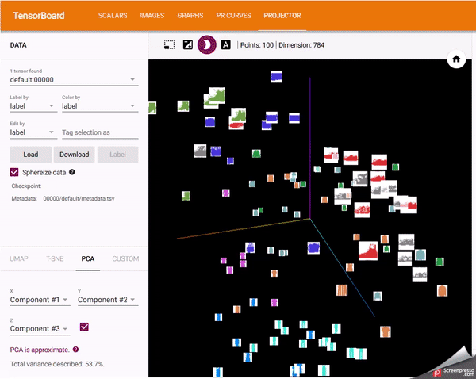

# Creating and Deploying Deep Learning applications in PyTorch

Experimenting with the concepts present in the book "Programming Pytorch for Deep Learning" by Ian Pointer. I create the following models:

- Create a simple neural network to classify the Fashion MNSIT dataset.

     :ledger: [Colab Notebook](https://colab.research.google.com/github/kjamithash/Pytorch_DeepLearning_Experiments/blob/master/SimpleNet_Fashion_MNIST_Pytorch.ipynb)

- Create a convolution neural network to classify the Fashion MNSIT dataset.

    :ledger: [Colab Notebook](https://colab.research.google.com/github/kjamithash/Pytorch_DeepLearning_Experiments/blob/master/FashionCNN_Fashion_MNIST_Pytorch.ipynb)

- Experiment with transfer learning to improve the accuracy of the CNN model. 

    :ledger: [Colab Notebook](https://colab.research.google.com/github/kjamithash/Pytorch_DeepLearning_Experiments/blob/master/FashionMNIST_ResNet_TransferLearning.ipynb)

- Using Tensorboard to visualize a neural network with Pytorch 
    
    :ledger: [Colab Notebook](https://colab.research.google.com/github/kjamithash/Pytorch_DeepLearning_Experiments/blob/master/Tensorboard_Pytorch_FashionMNIST.ipynb)

 

